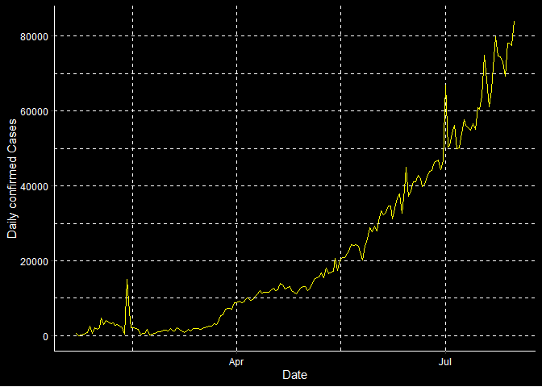

<!-- README.md is generated from README.Rmd. Please edit that file -->

# CoronaShiny

<!-- badges: start -->

[](https://github.com/etc5523-2020/r-package-assessment-vvuu0009/actions)
<!-- badges: end -->

The goal of CoronaShiny is to …

## Installation

<!-- You can install the released version of CoronaShiny from [CRAN](https://CRAN.R-project.org) with: -->

<!-- ``` r -->

<!-- install.packages("CoronaShiny") -->

<!-- ``` -->

The development version from [GitHub](https://github.com/) with:

``` r
# install.packages("devtools")
devtools::install_github("etc5523-2020/r-package-assessment-vvuu0009")
```

This package contains the shiny application and functions exploring the
current state of coronavirus as at 31 July 2020.

Follow the link to go to the pkgdown website for more information:
[CoronaShiny](https://etc5523-2020.github.io/r-package-assessment-vvuu0009/)

The main functions in this package includes:

  - **launch\_app**: This function runs the Coronavirus Shiny
    Application exploring the state of Coronavirus as at July 31 2020  
  - **cumplot**: This function produces a line graph of coronavirus
    cases for a selected case type and continent with date on the x-axis
    and daily cases for the selected `Type` and `Continent` on the
    y-axis.
  - **selectInput01**: This function changes the selectInput function of
    the Shiny app based on the desired input

This package also contains the following data sets:

  - **corona\_cont**: This data set shows the daily coronavirus cases by
    each continent by case type
  - **coronavirus\_july20**: This data set shows the cumulative
    coronavirus cases as at 31 July 2020 for each country

## Example

Below displays a sample of both data sets:

``` r
library(CoronaShiny)
library(tibble)
corona_cont
#> # A tibble: 2,880 x 4
#>    date       continent type      cases
#>    <date>     <chr>     <chr>     <int>
#>  1 2020-01-22 Africa    confirmed     0
#>  2 2020-01-22 Africa    death         0
#>  3 2020-01-22 Africa    recovered     0
#>  4 2020-01-22 Americas  confirmed     1
#>  5 2020-01-22 Americas  death         0
#>  6 2020-01-22 Americas  recovered     0
#>  7 2020-01-22 Asia      confirmed   554
#>  8 2020-01-22 Asia      death        17
#>  9 2020-01-22 Asia      recovered    28
#> 10 2020-01-22 Europe    confirmed     0
#> # ... with 2,870 more rows
```

``` r
coronavirus_july20
#> # A tibble: 188 x 5
#>    Country        Continent `Total Confirmed` `Total Deaths` `Total Recovered`
#>    <chr>          <chr>                 <dbl>          <dbl>             <dbl>
#>  1 US             Americas            4562038         153314           1438160
#>  2 Brazil         Americas            2662485          92475           2008854
#>  3 India          Asia                1695988          36511           1094374
#>  4 Russia         Europe               838461          13939            637217
#>  5 South Africa   Africa               493183           8005            326171
#>  6 Mexico         Americas             424637          46688            327115
#>  7 Peru           Americas             407492          19021            283915
#>  8 Chile          Americas             355667           9457            328327
#>  9 United Kingdom Europe               304793          46204              1439
#> 10 Iran           Asia                 304204          16766            263519
#> # ... with 178 more rows
```

Below displays an example cumplot for confirmed cases in Asia

``` r
cumplot("confirmed", "Asia")
```


